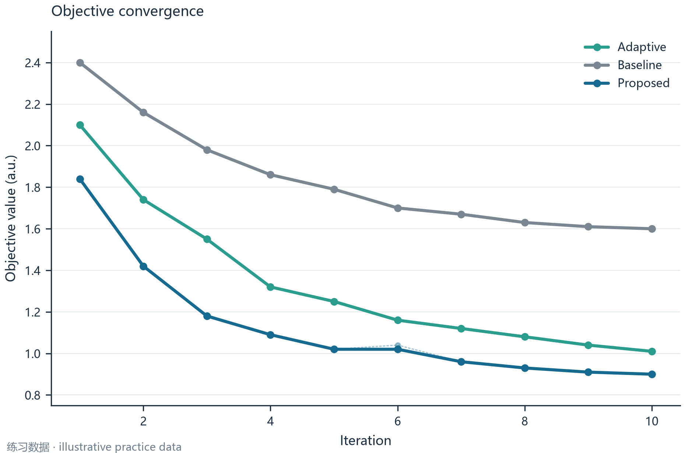
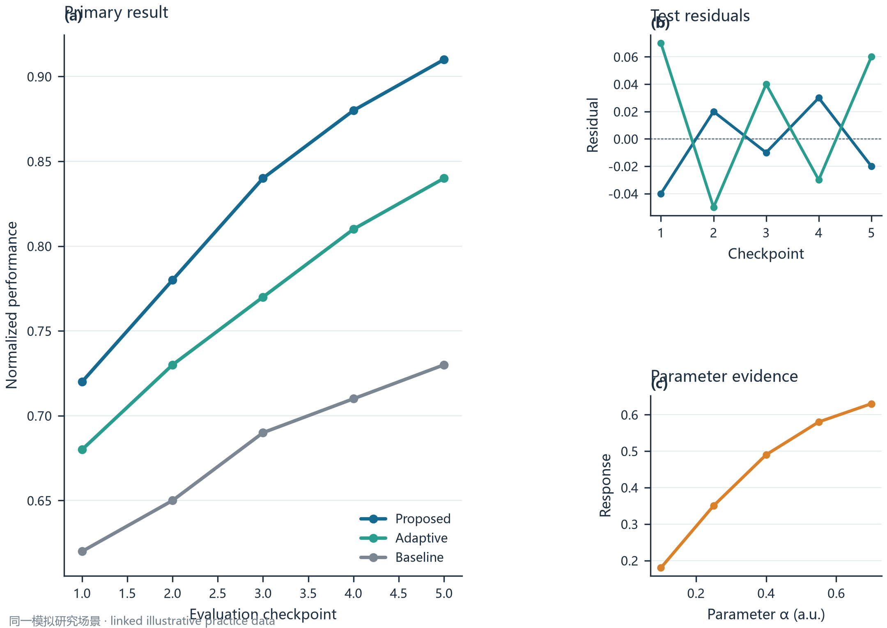

# Scientific Figure Studio

Scientific Figure Studio 是一个面向数学建模竞赛和科研论文的本地 Python 科研绘图工程。它用 Matplotlib 生成可复现的静态图表，提供统一的配色、字体、布局、导出和视觉审查流程，并保留完整可修改的 Python 源码。

## 当前内容

- `figure_studio/`：统一视觉系统、导出验证、算法绘图辅助函数和个人图库管理。
- `templates/`：六类算法图表、三类 Python 科研插图和固定 Nature 上游适配示例。
- `examples/data/`：明确标记的练习数据，不代表任何正式比赛结果。
- `examples/outputs/`：每张示例图的 PDF、SVG、PNG、源码、配置和数据清单。
- `.agents/skills/`：四个项目图表/图库 Skills，以及一个 `scientific-illustration` 插图 Skill。
- `figure_gallery/`：用户自己的科研图片参考图库。
- `docs/`：中文快速入门、Skill 使用、图库维护和源码修改说明。

## 安装

项目使用独立 Conda 环境，不依赖系统 Python：

```powershell
powershell -ExecutionPolicy Bypass -File tools/create_conda_env.ps1
conda activate scientific-figure-studio
```

脚本显式使用 `conda-forge`，不会要求接受默认 Anaconda channel 的条款。也可以在已配置 `conda-forge` 的机器上运行 `conda env create -f environment.yml`。

如果机器还没有 Conda，请先安装用户范围的 Miniconda 或 Miniforge，并取消系统 Python 注册和系统 PATH 修改。

## 第一个示例

在项目根目录运行：

```powershell
conda activate scientific-figure-studio
python templates/convergence/plot.py
```

生成的文件位于 `examples/outputs/fig_01_convergence/`。修改该目录中的 `config.py` 或模板目录中的配置后，再运行同一脚本即可复现图片。

六类图表和三类插图示例的详细位置和实际视觉检查结果见 `docs/TEST_REPORT.md`。正式使用时，请先把真实数据复制到独立的数据目录，更新 manifest 和字段说明，再选择合适模板。

## 示例预览

这些图片由仓库中的 Python 源码实际生成，使用的是明确标记的练习数据：





其余四类图片和对应源码见 [`design_system/figure_examples.md`](design_system/figure_examples.md)。

## Skills

在 Codex 中可以显式调用：

```text
$modern-scientific-figure
$algorithm-visualization
$figure-design-review
$figure-reference-manager
```

`scientific-illustration` 负责流程图、模型架构、几何/三维/网络和图表组合示意图；固定上游 `nature-figure` 通过安装器按提交版本接入，不把无许可证确认的上游文件复制进仓库。Skill 只负责工作流程和审查要求；最终图表仍由保存下来的 Python 源码生成。详见 [`docs/SKILLS_USAGE.md`](docs/SKILLS_USAGE.md) 和 [`docs/UPSTREAM_NATURE_FIGURE.md`](docs/UPSTREAM_NATURE_FIGURE.md)。

生成全部六张示例图：

```powershell
python tools/generate_examples.py
```

三类科研插图和 Nature 适配示例：

```powershell
python templates/illustration/flowchart/plot.py
python templates/illustration/architecture/plot.py
python templates/illustration/composite/plot.py
python templates/nature_adapter/plot.py
```

也可以一次生成 `fig_07`–`fig_10` 的完整交付目录（Nature 适配示例要求已安装固定 Skill）：

```powershell
python tools/generate_phase2_examples.py
```

## 参考图库

把新图片放入 `figure_gallery/00_inbox/`，然后运行图库更新命令或调用 `$figure-reference-manager`。系统会生成哈希、主色和布局等有限的可观察信息，不会修改原图或自动推断你的喜好。详见 [`docs/GALLERY_WORKFLOW.md`](docs/GALLERY_WORKFLOW.md)。

## 设计原则

科学准确性优先于装饰。项目默认使用白色背景、深蓝灰文字、克制的蓝色主色、青绿色辅助色、暖橙色强调色和中性灰辅助元素；颜色会与线型、标记或标签配合使用。详细规则见 [`design_system/DESIGN_GUIDE.md`](design_system/DESIGN_GUIDE.md)。
